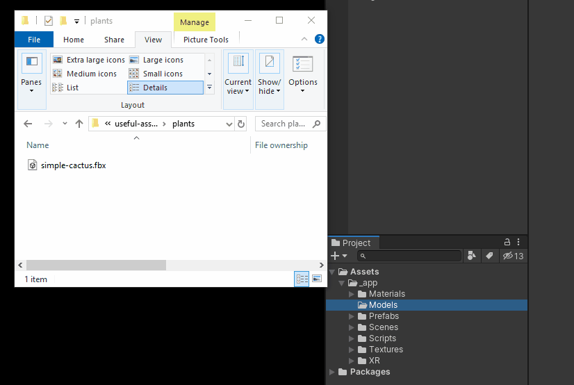
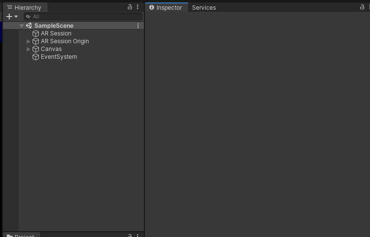
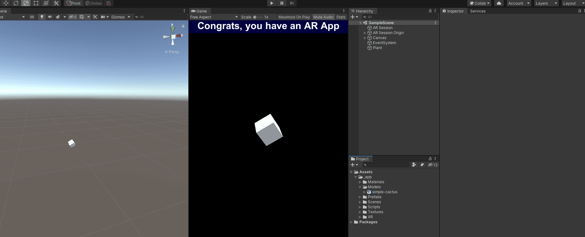
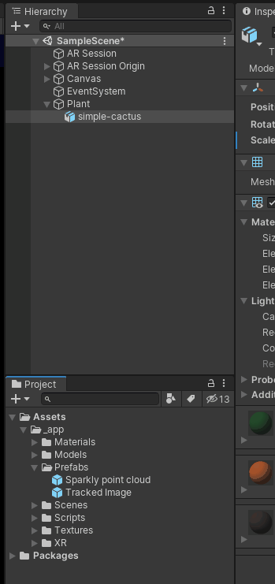
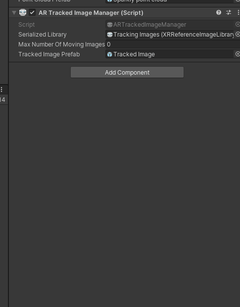
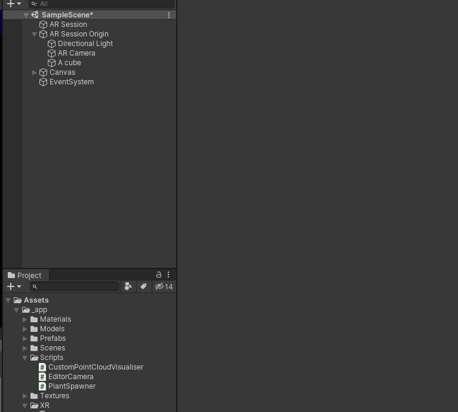
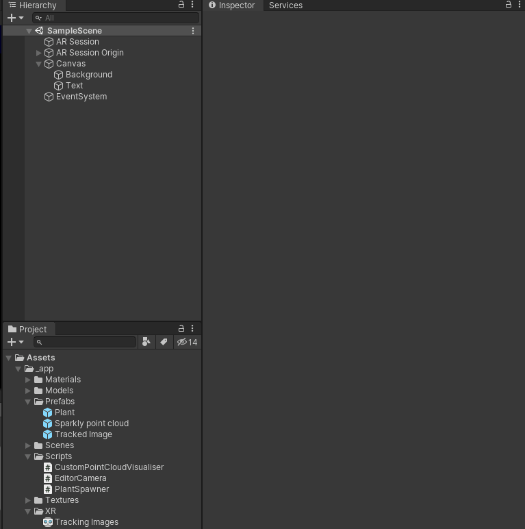
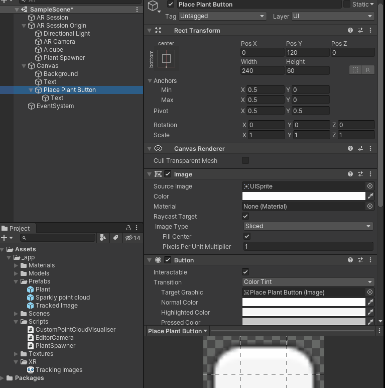
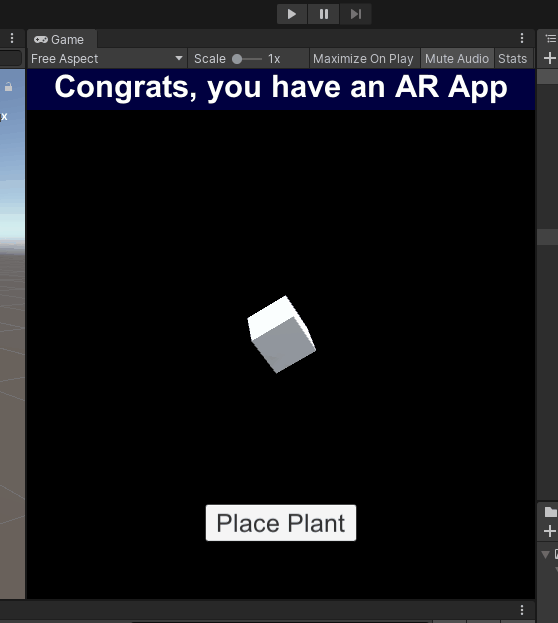

# Plant placement

By the end of this part, you will have an understanding how your phone can interact with the real world to place objects on the ground.

## 1. Create a "prefab" for your plant.

First thing to do is to create your plant model - this is what will get placed on the ground.

<details>
    <summary>Download a 3d model and drag it into your assets folder to import it</summary>



</details>

<details>
    <summary>In your scene, right click an empty area, and choose "Create Empty".  Rename it and ensure it is not transformed in any way.</summary>



</details>

<details>
    <summary>Drag the model under your plant game object, and resize to a reasonable size for your scene.</summary>



</details>

<details>
    <summary>Create a prefab out of the plant by dragging the root object into the Prefabs folder.</summary>



</details>

<details>
    <summary>Delete the plant from the scene</summary>
    <p>You can work this one out yourself :)</p>
</details>

This prefab will be one of the plants created when.

**Extension work**: Make a few more plant varieties!

## 2. Write a script for plant placement

At this point, you will have a plant prefab available - now we need to place the plant in the world, in the right spot.


<details>
<summary>Create the script file</summary>

1. Right-click the "Scripts" folder and choose "Create - C# Script"
2. Call it "PlantSpawner"
3. Open script in some codes

</details>

<details>
    <summary>Add the dependencies</summary>

```cs
    [SerializeField] private ARAnchorManager anchorManager;
    [SerializeField] private ARRaycastManager raycastManager;
    [SerializeField] private Camera camera;
    [SerializeField] private GameObject plantPrefab;
```

<p>These are dependencies we will we need to implement it - the implementation will explain</p>

</details>

<details>
    <summary>Write functions to create a plant at a particular pose</summary>

```cs
void PlacePlant(Pose pose)
{
    var plant = CreatePlant(pose);
    plant.transform.Rotate(Vector3.up, Random.Range(0, 360));
    plant.transform.localScale = Vector3.one * Random.Range(0.8f, 1.1f);
}
```

`PlacePlant` creates a plant at the specified pose, and then applies a bit of randomness to make things look a little more unique

```cs
GameObject CreatePlant(Pose pose)
{        
    // TODO: Editor support

    var anchor = anchorManager.AddAnchor(pose);
    var plantObject = Instantiate(plantPrefab, anchor.transform);
    return plantObject;
} 
```

A `Pose` represents a `position` and `rotation` - this method creates an [anchor](https://docs.unity3d.com/Packages/com.unity.xr.arfoundation@3.0/manual/anchor-manager.html) at the specified pose.

What's an anchor? Basically, it forces the transform to stay in the same position _in the world_, even if the accuracy is lost due to drift or whatever.

Aaaand for editor support, add this near the top of `CreatePlant` - this is basically a way to make sure we can use the app with the "play" button and not waste time with compiling.

```cs
#if UNITY_EDITOR
    if (!UnityEditor.EditorApplication.isRemoteConnected)
    {
        var parent = new GameObject();
        parent.transform.position = pose.position;
        parent.transform.rotation = pose.rotation;
        
        var editorPlantObject = Instantiate(plantPrefab, parent.transform);
        return editorPlantObject;
    }
#endif
```

<p>These are dependencies we will we need to implement it - the implementation will explain</p>

</details>

<details>
    <summary>Write a function to find the placement position</summary>

```cs
public void PlacePlant()
{
    var ray = new Ray(camera.transform.position, camera.transform.forward);
    
    var raycastHits = new List<ARRaycastHit>();
    if (raycastManager.Raycast(ray, raycastHits))
    {
        var pose = raycastHits[0].pose;
        PlacePlant(pose);
    }
}
```

This part does a raycast into the world to look for a place in the real world for placement.  Essentially casts from the camera position.

For editor support (no world to raycast against)
    
```cs
#if UNITY_EDITOR
if (!UnityEditor.EditorApplication.isRemoteConnected)
{
    var pos = ray.GetPoint(2); // 2m in front
    PlacePlant(new Pose(pos, Quaternion.identity));
    return;
}
#endif
```
</details>

Voila! The script is done. 

## 3. Add the plant spawner

<details>
    <summary>Ensure the session origin has the required components</summary>

Add the `AR Anchor Manager`, `AR Raycast Manager` and `AR Plane Manager` to the session origin.

Note the plane manager doesn't integrate with the script directly, but the raycast manager uses it for better inferred raycasts.


</details>

<details>
    <summary>Create the plant spawner game object, component and fill in the details</summary>

1. Create an empty game object for the plant spawner
2. Add the plant spawner components
3. Drag in all the dependencies required for the plant spawner


</details>

## 4. Wire up a button

<details>
    <summary>Add a button to the canvas</summary>

You might want to tweak this a little more than I have!


</details>

<details>
    <summary>Wire up the event handler</summary>


</details>

## 5. Test it!

Hit play. OMIGOSH, it works.



Check it in, and [move on](2-water-plants.md)

Or [back to top](README.md)