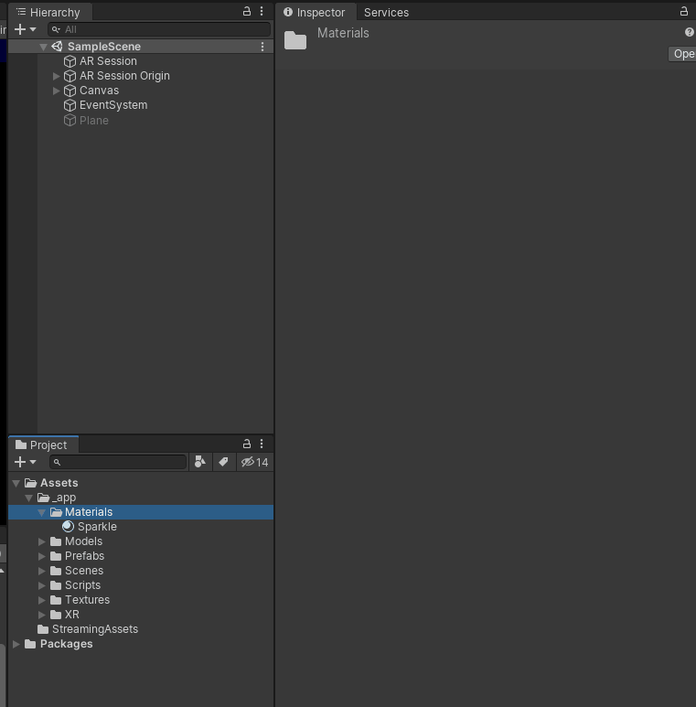
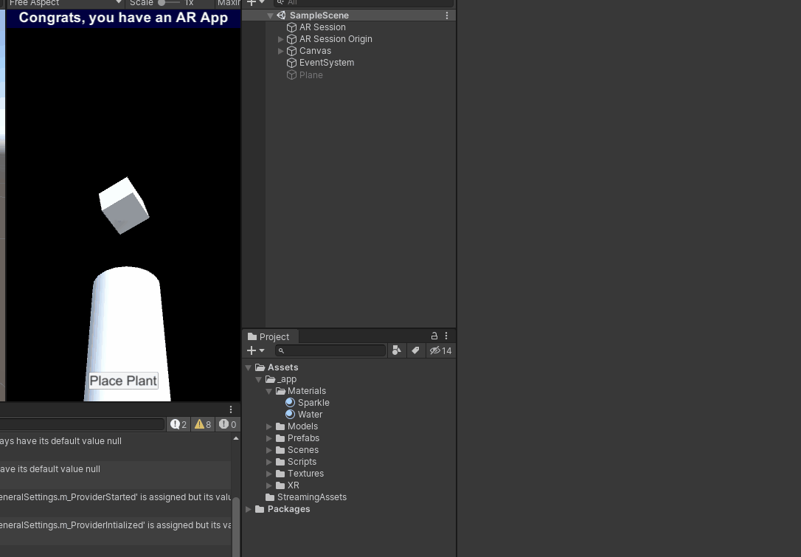
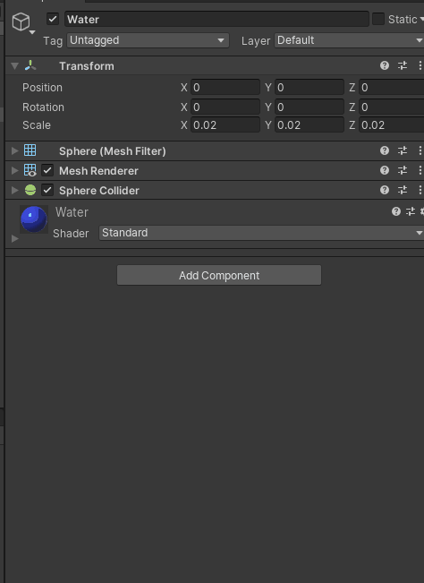
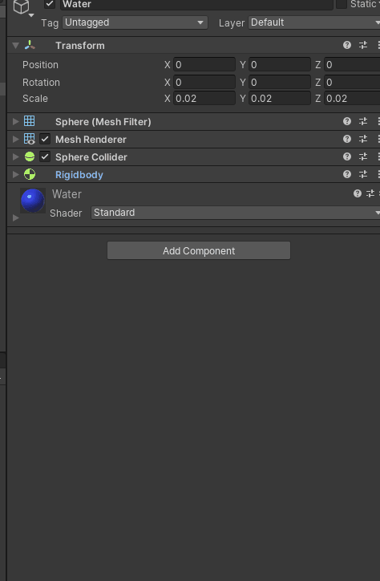
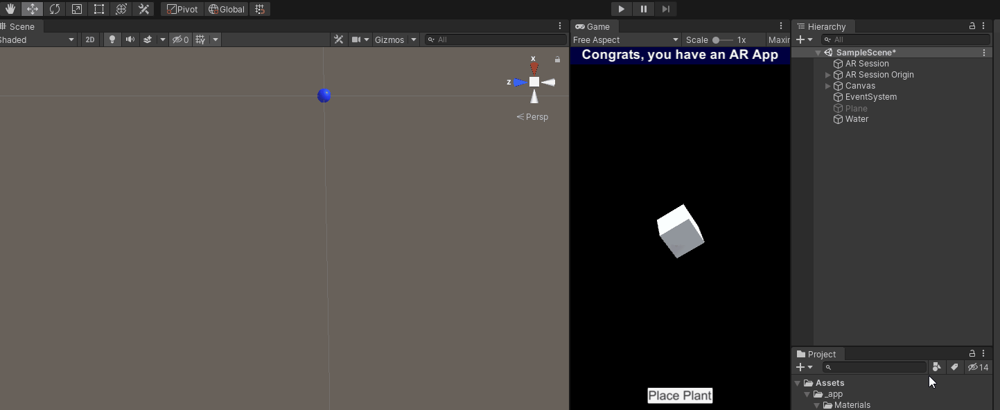
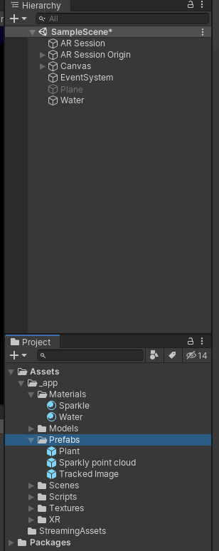

# Water the plants

By the end of this part, you will create a "hose" that waters the plants and makes them grow.

## High level approach

At a high level, we will have a few components contributing here - a hose that sprays water, water that collides with the plants, and plants that respond to being hit with water by growing.

## 1. Create a prefab for your water

Before we can do the hose, we need some water - so let's make that.

<details>
    <summary>Create a script for your water</summary>

```cs
public class Water : MonoBehaviour
{
    [SerializeField] float maxLifetime = 2;
    
    void Start()
    {
        StartCoroutine(PrepareToDie());
    }

    private IEnumerator PrepareToDie()
    {
        yield return new WaitForSeconds(maxLifetime);
        
        Destroy(gameObject);
    }

    private void OnCollisionEnter(Collision other)
    {
        Destroy(gameObject);
    }
}
```

Hopefully a pretty straight forward script - when it starts, it starts a little coroutine that makes it die after a few seconds.  In practice, this is so it doesn't clog up our scene with objects that are hundreds of metres below you (due to gravity).

Additionally, it inputs some collision logic - if it collides with something, we kill it.  No fancy VFX here!

</details>

<details>
    <summary>Create a water material</summary>

A `material` described how a `mesh` should render - what kind of shader to use, and any properties for that shader (eg. color).  When we imported the plant, it included a material - in this case, we're using a primitive object for water - a sphere - so we have to make our own material and set the colour



We've only done basic material changes here - it defaults to the standard shader, we just changed the colour property.

In practice, you'll want to use a simpler shader (under `Mobile`, for example) and choose good effects.  But hey, we're developers, not artists.

</details>

<details>
    <summary>Add a sphere to the scene, resize it, and apply the material to the renderer</summary>

This will become our water prefab - so size it the same as water.



Note this primitive comes with a Mesh Filter (what we're rendering), a mesh renderer (what renders it), and a mesh collider (smashes it into other things).

This animation has made it 2cm radius - choose what works for you though. Designing.

</details>

<details>
    <summary>Make it a rigid body</summary>

What's a rigid body? Basically, it applies physics to an object - specifically rigid body physics (it does not deform, just bounces and slides).

This is done by adding the rigid body component and that's it!



Note in this case, the rigid body is 1kg heavy.  This doesn't matter, since we're not really colliding it with other things - but nice to know!

</details>

<details>
<summary>Add the water script</summary>

Aaaaand last thing, your previously created water script.



</details>

<details>
    <summary>See it in action</summary>

Move your scene view to a good spot and hit play. It should fall and disappear in 2 seconds.



If you're feeling adventurous, add a Plane below it - it should disappear upon collision.

</details>


<details>
    <summary>Create a prefab out of it, and delete it</summary>



</details>