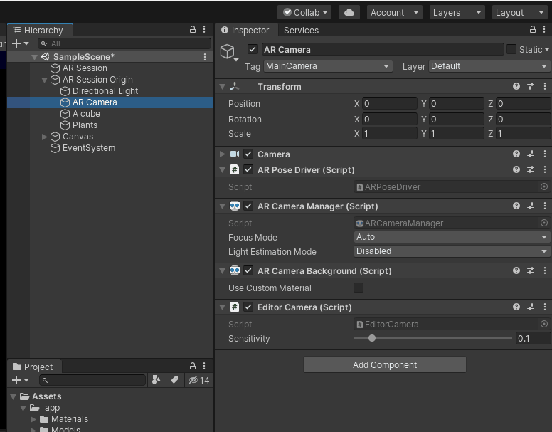
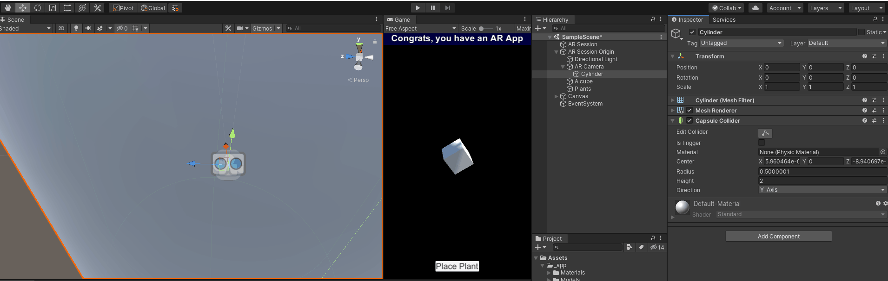
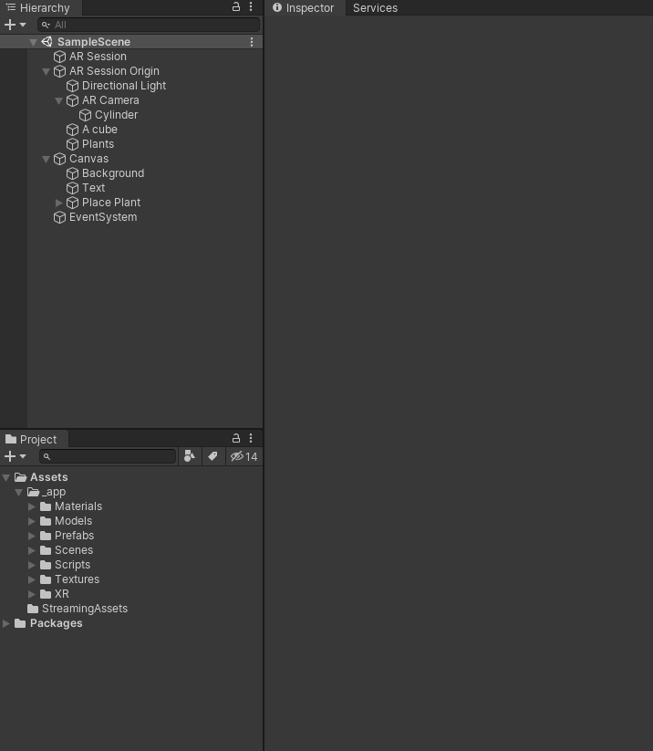
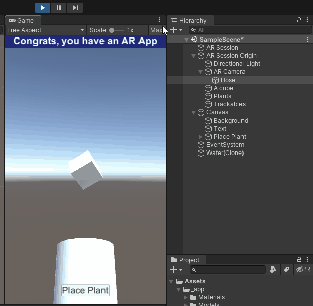
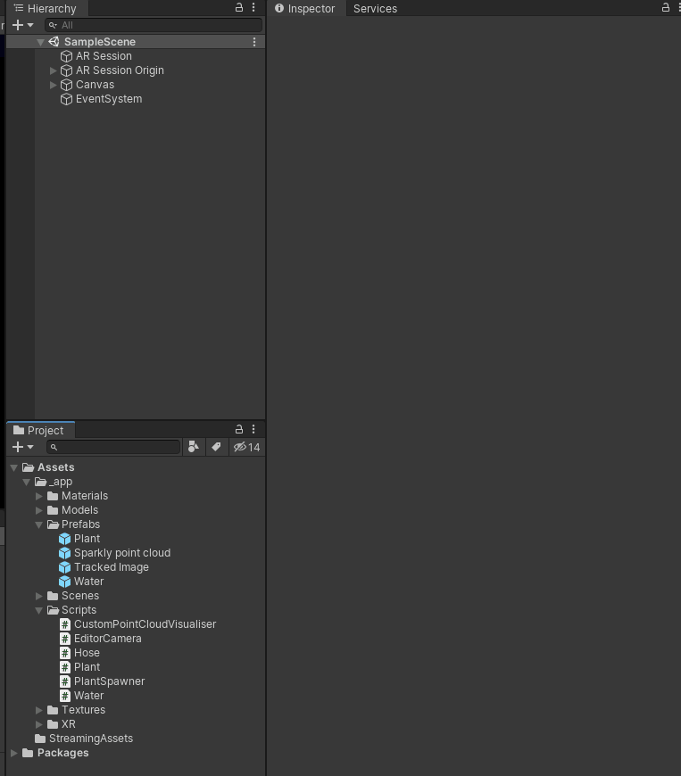
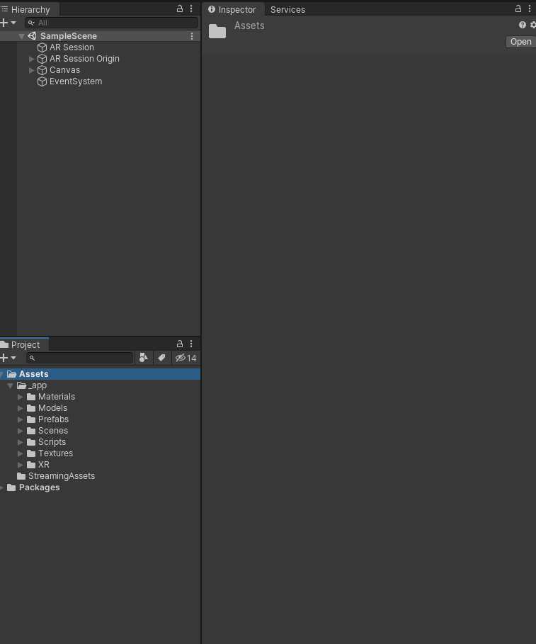
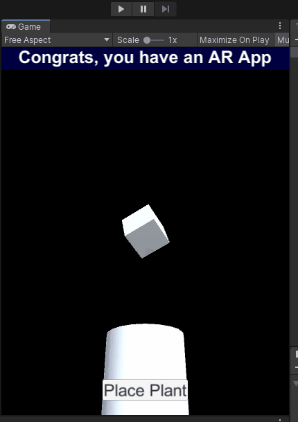

# Water the plants

By the end of this part, you will create a "hose" that waters the plants and makes them grow.

## High level approach

At a high level, we will have a few components contributing here - a hose that sprays water, water that collides with the plants, and plants that respond to being hit with water by growing.

## 1. Create a prefab for your water

Before we can do the hose, we need some water - so let's make that.

<details>
    <summary>Create a script for your water</summary>

```cs
public class Water : MonoBehaviour
{
    [SerializeField] float maxLifetime = 2;
    
    void Start()
    {
        StartCoroutine(PrepareToDie());
    }

    private IEnumerator PrepareToDie()
    {
        yield return new WaitForSeconds(maxLifetime);
        
        Destroy(gameObject);
    }

    private void OnCollisionEnter(Collision other)
    {
        Destroy(gameObject);
    }
}
```

Hopefully a pretty straight forward script - when it starts, it starts a little coroutine that makes it die after a few seconds.  In practice, this is so it doesn't clog up our scene with objects that are hundreds of metres below you (due to gravity).

Additionally, it inputs some collision logic - if it collides with something, we kill it.  No fancy VFX here!

</details>

<details>
    <summary>Create a water material</summary>

A `material` described how a `mesh` should render - what kind of shader to use, and any properties for that shader (eg. color).  When we imported the plant, it included a material - in this case, we're using a primitive object for water - a sphere - so we have to make our own material and set the colour


We've only done basic material changes here - it defaults to the standard shader, we just changed the colour property.

In practice, you'll want to use a simpler shader (under `Mobile`, for example) and choose good effects.  But hey, we're developers, not artists.

</details>

<details>
    <summary>Add a sphere to the scene, resize it, and apply the material to the renderer</summary>

This will become our water prefab - so size it the same as water.


Note this primitive comes with a Mesh Filter (what we're rendering), a mesh renderer (what renders it), and a mesh collider (smashes it into other things).

This animation has made it 2cm radius - choose what works for you though. Designing.

</details>

<details>
    <summary>Make it a rigid body</summary>

What's a rigid body? Basically, it applies physics to an object - specifically rigid body physics (it does not deform, just bounces and slides).

This is done by adding the rigid body component and that's it!


Note in this case, the rigid body is 1kg heavy.  This doesn't matter, since we're not really colliding it with other things - but nice to know!

</details>

<details>
<summary>Add the water script</summary>

Aaaaand last thing, your previously created water script.


</details>

<details>
    <summary>See it in action</summary>

Move your scene view to a good spot and hit play. It should fall and disappear in 2 seconds.


If you're feeling adventurous, add a Plane below it - it should disappear upon collision.

</details>


<details>
    <summary>Create a prefab out of it, and delete it</summary>


</details>

## Create a hose

<details>
<summary>Write a hose script</summary>

Alright, we want a hose now to squirt out the water.

Code time!

```cs
public class Hose : MonoBehaviour
{
    [SerializeField] float emissionRate = 10f;
    
    [SerializeField] GameObject waterDrop;
    [SerializeField] float hoseSpeed = 5;

    void Update()
    {
        if (waterDrop == null)
            return;
        
        if (Random.value < emissionRate * Time.deltaTime)
        {
            SpawnADrop();
        }
    }

    private void SpawnADrop()
    {
        var obj = Instantiate(waterDrop, transform.position, Quaternion.identity);
        var rigidBody = obj.GetComponent<Rigidbody>();
        rigidBody.velocity = (transform.up + Random.onUnitSphere*0.1f) * hoseSpeed;
    }
}
```

So you will be sick of seeing code like this - timings, spawning, and a little vector math.  Let's go through it!

```cs
if (waterDrop == null)
    return;
```

Helpful if you want to be defensive - this bit ensures the hose won't do anything if you haven't specified what it squirts.

```cs
if (Random.value < emissionRate * Time.deltaTime)
{
    SpawnADrop();
}
```

The emission rate is in "drops per second" - but to make it more interesting, we use some random logic.

`Random.value` spits out a value between 0 and 1 (why it's a property and not a method, I have no idea) - so this basically says for each frame, there's a chance of emitting based on the emission rate.

```cs
var obj = Instantiate(waterDrop, transform.position, Quaternion.identity);
```

Creates a new instance of the game object - much like the plant.  In this case though, we won't be anchoring it.

```cs
var rigidBody = obj.GetComponent<Rigidbody>();
rigidBody.velocity = (transform.up + Random.onUnitSphere*0.1f) * hoseSpeed;
```

We want to make the water come out at speed, not just fall down straight away - so we set the velocity on the rigid body.  

In this case, we want the water to go "up" relative to the hose.  We also add some random variation here to make it more hosey/interesting.

Importantly, we don't make these water drops go "under" the hose - the transforms will be all messed up.  After the hose spits out some water, the water should be _independent_ of the hose.
</details>

<details>
<summary>Add a cylinder to the scene, under the camera</summary>

This will be the nozzle of the hose - our phone!



</details>

<details>
    <summary>Size and place the hose appropriately</summary>

So umm, that's not right.  Let's right-size it:



</details>

<details>
    <summary>Turn our cylinder into a hose</summary>

Let's turn this cylinder into a hose now.  Rename it, remove the collider (we don't want it messing with our water), and add and populate the hose script.



</details>

<details>
    <summary>Check it works</summary>

Hit play. With a bit of luck, you'll have something like this, but without the gif artifacts.



Feel free to tweak the rates, randomness etc. to your liking - and don't be afraid to go back to your water prefab and make it better.

A few things:

* We can be much more fancy with our water prefab to get better results - try adding a particle system to the water prefab that spreads out blue particles in a sphere, for example
* Note all the water being created and destroyed in the scene - often this is a performance problem, but that's a more advanced topic that we'll leave for now.  TL;DR - we should consider an object pool instead.

</details>

## 3. Make the plants grow

Time to make the plants grow.

The idea here is to look for collisions from objects in a particular layer (eg. the water layer), and then simply increase the plant scale.

<details>
    <summary>Write the script</summary>

Same deal - create a script, call it plant, here's the contents:

```cs
public class Plant : MonoBehaviour
{
    [SerializeField] LayerMask growthSource;
    [SerializeField] float growthRate = 0.01f;
    [SerializeField] float maxScale = 2f;

    private Vector3 initialScale;
    private float scaleMultiplier;

    void Start()
    {
        initialScale = transform.localScale;
        scaleMultiplier = 1;
    }

    private void OnCollisionEnter(Collision other)
    {
        if ((other.gameObject.layer & growthSource) == growthSource)
            return;

        scaleMultiplier += growthRate;

        if (scaleMultiplier > maxScale)
        {
            enabled = false;
            scaleMultiplier = maxScale;
        }

        transform.localScale = initialScale * scaleMultiplier;
    }
}
```

</details>

<details>
    <summary>Create and assign a layer for the water</summary>



</details>

<details>
    <summary>Add and configure the plant component</summary>



</details>

## 4. Test it!

Hit play, test it out:



So bad, right?

Think about how we can make this better:

1. Tweak the growth rate
2. Add ability to turn the hose on and off
3. Adjust hose strength

Check it in, and [move on to multiplayer](3-multiplayer.md) 

Or [back to top](README.md)
